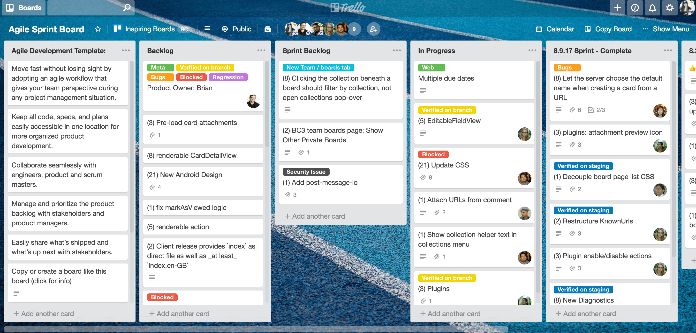

# **Developer Collaboration Guide**

The first step of effective collaboration is identifying a software development methodology to use - or [Software Development Life Cycle(SDLC)](https://blog.planview.com/top-6-software-development-methodologies/)

## Agile development
As a software developer, it is inevitable that you will encounter **Agile methodology**. A good place to start is by reading the [Agile manifesto](https://agilemanifesto.org/) and the principles behind the manifesto. It is brief, yet absolutely complete. It was written by 17 software developers who sat together to uncover better ways of developing software.

## Tools
Because we still value these items on the right, we need to consider various technologies that will make remote software development and collaboration seamless and effective.
Scrum is an agile project management framework that describes a set of meetings, tools, and roles in team work.

### **Definition of scrum terms**
1. **Scrum master** - facilitates daily standup, encourages team collaboration 
   - Because the project team will be made up of various tracks, each track will have a team lead in charge of leading daily standup, addressing blockers and keeping the scrum master updated on progress.
2. **Scrum team** - team of developers and designers working on the project
3. **Backlog** - master list of work that needs to get done
4. **Blocker** -  obstacle faced in the tackling of an assigned task
5. **Standup** - in a team of developers working on a project, short meetings are held daily, usually mornings. The term comes from the fact that during the meetings, a developer literally stands up and states briefly:
   - What did I do yesterday? -achievements-
   - What do I plan to do today? -tasks-
   - Am I facing any challenges? -blockers-
    `Note:` Standups can be run as often as suits the team
6. **Sprint** - a time period, usually between 1 week and 1 month and typically 2 weeks, in which a team works to complete a set amount of user stories. A project is generally divided into sprints in which, each sprint should produce a usable end product, increment.
7. **Kanban board** - a basic board divides a sprint into cards`'To do'`, `'In progress'` and `'Complete'`. It can be altered to suite the needs of the team with cards like `'In review'`, `'Resources'`
      

### **Breakdown of tools and processes** 
Processes:
- Organize backlog from user feedback
- Plan sprints 
- Run sprints with daily standups

Tools for:
1. **Communication**
   - *`Slack`*  is a great tool for general communication and integrates with just about everything a developer cares about.
   - *`Google Meet`* is great for running standups even in large teams. It allows for screen sharing, and has no time limit for a large number of attendees. Google calendar also comes in handy when scheduling recurring meetings.
2. **Project management**
    Kanban boards come in here. 
    Each github repo has a Project section for managing tasks in the repo. Some external resources include: 
   - [*Trello*](https://www.trello.com/)
   - [*Atlassian Jira*](https://www.atlassian.com/software/jira)

3. **Design and prototyping**
    Design is an important part of a collaborative project. It helps frontend developers from straying from the agreed upon design saving hours of back and forth.
   -  [*Figma*](https://www.figma.com/) - web based, collaborate as you would on a google doc
  
### **Coding**
  When it comes to coding in a collaborative environment, coding best practices play a major role in it's effectiveness.  
   1. A good place to start is [The perfect code review process](https://medium.com/osedea/the-perfect-code-review-process-845e6ba5c31). The writer of the article, Robert Cooper, takes you through a fictional scenario of Jimmy and his team
   2. [**Gitflow**](https://www.atlassian.com/git/tutorials/comparing-workflows/gitflow-workflow#:~:text=Gitflow%20Workflow%20is%20a%20Git,designed%20around%20the%20project%20release.&text=Instead%2C%20it%20assigns%20very%20specific,and%20when%20they%20should%20interact.) is a branching model in which a team of developers work on independent features. A feature should not be dependant on another feature. Programmers should be able to work on features simultaneously without having to wait on the work of another developer.
      - Naming convention - each developer works on a feature branch eg: `ft-header`, `ft-authentication`, `ft-models`
      - Pull requests are made to a `development` branch **not master**. At any given time, the master branch should contain deployable work (no bugs, no incomplete work). An incomplete branch should not be merged
      - If modifications are requested after your branch has been reviewed, [interactive rebasing](https://thoughtbot.com/blog/git-interactive-rebase-squash-amend-rewriting-history) should be done, no extra commits.

### **Extra remarks**
   - Take some time and listen to some of [Uncle Bob's talks](https://www.google.com/search?q=uncle+bob+on+youtube&oq=uncle+bob+on+youtube&aqs=chrome..69i57.5040j0j7&client=ms-android-oppo-rvo3&sourceid=chrome-mobile&ie=UTF-8) on Youtube
   - [Read](https://chris.beams.io/posts/git-commit/#imperative): Best practices when it comes to git commits
   - Always keep in mind:
       - Code is read more often than it is written. 
       - It is your duty as a programmer to write readable and maintainable code.

> <small>Originally complied for DSC_MOI Community Projects Team</small> 